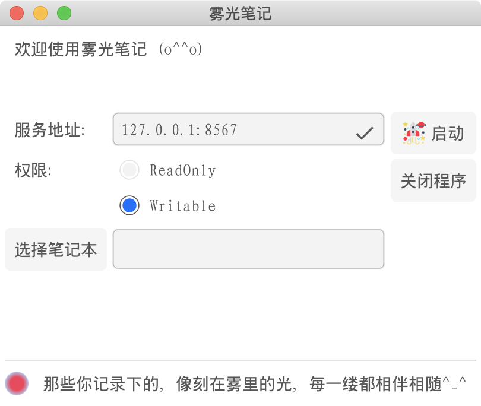

# 那些你记录下的，像刻在雾里的光，每一缕都相伴相随^_^
## 简介
雾光笔记是一款基于"简洁、高效、方便"为目的而开发的个人知识管理系统。
虽然提供了一个桌面启动的gui程序，但是笔记的主要操作界面是基于b/s架构的。正因为如此，雾光笔记也可以当作云笔记来使用。
## 项目构成
* launcher：桌面启动器，控制程序的启动、关闭和相关参数设置。
* server：后台服务，本质为web后端服务，提供与本地文件的交互。
* screeb：操作界面，本质为react前端界面，提供用户操作界面。

## 开发者指南
参考对应子项目中的说明，自行修改编译打包。

## 使用说明
1. 运行launcher程序（在macos上直接执行主程序即可）。
   
2. 配置相应的参数，然后点击启动。其中：
   * 服务地址如果设置互联网ip地址，则可以提供互联网访问，则雾光笔记就成为了云笔记。
   * 权限如果设置readonly，则对文件系统只有只读权限。
   * 选择笔记本的路径，即雾光笔记的本地文件路径。
   
3. 点击链接，即可调用默认浏览器打开操作界面。
   * 侧边栏：本地文件系统的树形展示，可以进行新增和删除操作。
   * 顶部：提供控制按钮，主要是保存（当保存的时候，如果内容里有图片外链，会弹出选择，是否将图片保存本地并替换外链）。
   * 中间区域：集成tinymce富文本框架。
   
4. 进行新增和删除操作时，一定要先在侧边选中节点，确定操作的位置。
   

