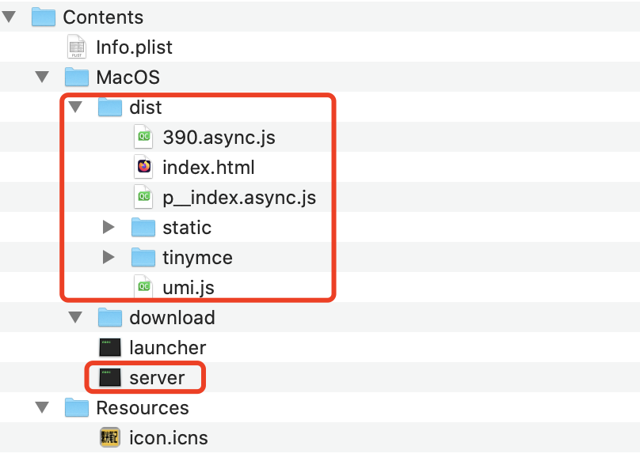

# 桌面启动器

## 简介
雾光笔记是一款基于"简洁、高效、方便"为目的而开发的个人知识管理系统。 
本项目为其桌面启动器项目。采用fyne构建。

## 开发指南
### 编译并安装
`fyne install`

### 拷贝前后端
1. 上一步完成后，会自动在本机生成适用的程序。桌面启动器的可执行文件即为launcher。
2. 将后端项目server生成的可执行程序server拷贝到该目录。
3. 将前端项目screen生成的dist文件夹拷贝到该目录。
4. 如下为macos上最终截图：
